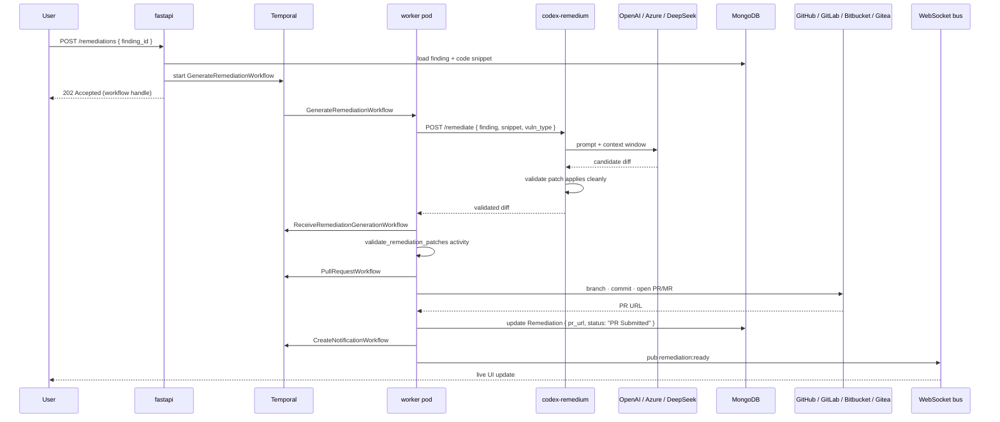

# How AI Remediation Works \{#concepts_ai-remediation-1\}

When you click **Create AI Remediation** on a finding, Plexicus runs a chain of nine Temporal activities that ends with a pull request in your SCM. This page walks the chain and names the workflow at each step, so you can debug a stuck remediation by reading the Temporal UI.

The fix path is **deterministic** — same finding, same code, same prompt, same diff. The variation comes from the LLM, which is the only non-deterministic step in the pipeline.

## The full sequence \{#concepts_ai-remediation-2\}

Read it once linearly; come back to it when the UI says a finding is stuck in **Processing**.

## The nine steps, in order \{#concepts_ai-remediation-3\}

<Steps>
  <Step title="Eligibility check">
    Not every finding is fixable. The API checks `remediation_type` on the Finding document:

    - `pr` — Plexicus has a code transformation strategy. Eligible.
    - `issue` — patch generation isn't supported (e.g. design-level CWEs). Path forks to **Create Issue** instead.

    Eligibility is decided by the scanner adapter at parse time, not by the LLM.
  </Step>

  <Step title="Trigger GenerateRemediationWorkflow">
    `POST /remediations` returns `202 Accepted` with a workflow ID. The HTTP request never blocks — all subsequent state lives in Temporal.
  </Step>

  <Step title="Load context from MongoDB">
    The worker fetches the Finding plus a snippet of the affected code (typically ±20 lines) using `DownloadCodeSnippetWorkflow`. The snippet is materialized from MinIO, where the original scan archive was stored.
  </Step>

  <Step title="Call Codex Remedium">
    Worker `POST`s to `codex-remedium:7200/remediate` with the finding + snippet + vulnerability type. Codex Remedium is stateless — it does not see other findings, the repo as a whole, or your other tenants' code.
  </Step>

  <Step title="LLM generates the candidate diff">
    Codex Remedium calls the configured model via LiteLLM. Provider is set per-tenant by `OPENAI_API_KEY` + `OPENAI_BASE_URL` — supported endpoints are OpenAI, Azure OpenAI, and DeepSeek. The prompt is templated by vulnerability class (SQL injection, XSS, command injection, …) so different CWEs hit different system prompts.
  </Step>

  <Step title="Validate the patch">
    Codex Remedium tries to apply the diff to the original snippet **before** returning. If the diff doesn't apply cleanly (line offsets shifted, syntax broke), it retries up to three times with regenerated diffs. After the third failure, it returns an error and the finding falls back to the **Issue** path.
  </Step>

  <Step title="Open the PR/MR">
    `PullRequestWorkflow` clones the target branch, applies the validated diff, commits with a message like `fix: <CWE-ID> in <file> via Plexicus`, pushes a new branch, and opens a pull request through the appropriate plugin (`plugins/github`, `plugins/gitlab`, etc.). The PR description includes the original finding, the rationale, and a link back to Plexicus.
  </Step>

  <Step title="Update the Remediation document">
    Worker writes back to MongoDB: `pr_url`, `branch_name`, `processing_status: "PR Submitted"`. The Finding's status changes from **Processing** to **PR Submitted**.
  </Step>

  <Step title="Notify the user">
    `CreateNotificationWorkflow` publishes a `remediation:ready` event to Redis Pub/Sub. The frontend's WebSocket connection picks it up and updates the UI in place — no refresh needed.
  </Step>
</Steps>

## When something goes wrong \{#concepts_ai-remediation-4\}

<AccordionGroup>
  <Accordion title="Stuck in Pending Input" icon="material-symbols:hourglass-empty">
    Some remediations require user input (e.g. choose between "remove the dep" vs "pin to a fixed version"). The workflow pauses on a Temporal signal until the user submits the input via `PUT /remediations/{id}/edit`.

    **What to check:** the Finding detail page should show the input prompt. If it doesn't, the Temporal workflow is stuck — open the Temporal UI and look for a `WaitForUserInput` activity.
  </Accordion>

  <Accordion title="Stuck in Processing" icon="material-symbols:settings-outline">
    Codex Remedium is running. Long ones (deep transitive dependency rewrites) can take 90+ seconds. If it has been more than ~5 minutes, it is hung.

    **What to check:** `kubectl logs -n plexicus deploy/codex-remedium` for stack traces. Most often: rate-limited LLM, expired `OPENAI_API_KEY`, or the LLM returned a non-applicable diff three times in a row (workflow eventually completes with status `failed`).
  </Accordion>

  <Accordion title="PR opened but Finding not updated" icon="material-symbols:sync-problem-outline">
    The diff applied and the PR exists in your SCM, but the Finding still shows **Processing**.

    **What to check:** the worker pod's logs. Most likely Temporal disconnected between steps 7 and 8, the workflow retried, and the second PR-creation attempt failed because the branch already existed. Manually update the Finding via the API and close the duplicate branch.
  </Accordion>

  <Accordion title="Patch validates but causes regression" icon="material-symbols:bug-report-outline">
    Codex Remedium validates that a diff *applies*, not that it *passes your tests*. CI is your safety net. The PR description includes a "review checklist" pointing the human reviewer at the parts most likely to break.

    **What to do:** reject the PR; the Finding moves to **PR Rejected** and is eligible for a new remediation attempt.
  </Accordion>
</AccordionGroup>

## What's stored, where \{#concepts_ai-remediation-5\}

| Data | Store | Lifetime |
|---|---|---|
| Finding document | MongoDB | Until deleted by user or retention policy |
| Code snippet (input to LLM) | MinIO | Same as scan archive |
| Generated diff | MongoDB (on Remediation document) | Until finding is closed |
| Prompt + raw LLM response | **Not stored** | In-memory only, discarded after validation |
| PR metadata (URL, branch, commit) | MongoDB + the SCM itself | Forever |

The "not stored" row is intentional. Plexicus does not retain LLM transcripts. If you need audit-grade trails of what the model said, configure your LLM provider's own logging (Azure OpenAI's content-safety logs, OpenAI's request retention).

## Related \{#concepts_ai-remediation-6\}

<CardGroup cols={2}>
  <Card title="Findings Model" icon="material-symbols:bug-report-outline" href="/docs/concepts/findings-model">
    Where the `remediation_type` field comes from and what the other Finding statuses mean.
  </Card>
  <Card title="Architecture" icon="material-symbols:dns-outline" href="/docs/concepts/architecture">
    Where Codex Remedium and the worker pods live in the broader system.
  </Card>
  <Card title="Work with Findings (Recipe)" icon="material-symbols:bolt-outline" href="/docs/recipes/work-with-findings">
    The user-facing flow for triggering a remediation.
  </Card>
  <Card title="Self-Hosted: Provider Config" icon="material-symbols:key-outline" href="/docs/self-hosted/configuration">
    How to wire `OPENAI_API_KEY` for OpenAI, Azure OpenAI, or DeepSeek.
  </Card>
</CardGroup>
