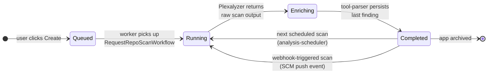

# Applications Lifecycle \{#concepts_applications-lifecycle-1\}

When you create an Application — by pointing Plexicus at a repository in a connected SCM — it walks through four lifecycle states. Each state is owned by a specific Temporal workflow; the UI's progress indicator is just a projection of the workflow's current step. This page names every workflow, so a stuck application can be diagnosed by reading Temporal directly.

## The four states \{#concepts_applications-lifecycle-2\}



An Application does not have its own state machine — it inherits the state of its **most recent scan**. That's why a previously-Completed app moves back to **Running** when a webhook fires.

## What each state means \{#concepts_applications-lifecycle-3\}

<AccordionGroup>
  <Accordion title="Queued" icon="material-symbols:hourglass-empty" defaultOpen>
    The scan request has been accepted and is waiting on Temporal's task queue. The owning workflow is `RequestRepoScanWorkflow`. Queue depth depends on:

    - Available `worker/` pods (cluster capacity)
    - Other in-flight scans for the same client (per-tenant concurrency limits)
    - Plexalyzer worker availability (each `plexalyzer/code` pod handles one scan at a time)

    **Typical duration:** seconds to a few minutes. Anything longer means the worker pool is saturated — scale `worker/` and/or `plexalyzer/code` deployments.
  </Accordion>

  <Accordion title="Running" icon="material-symbols:play-circle-outline">
    Plexalyzer is executing scanners. The worker has called `POST plexalyzer:8007/analyze` with the repository URL, branch, and the list of `included_tools`. Plexalyzer clones the repo, runs each scanner sequentially (some in parallel where the tools tolerate it), and streams output back.

    **Tools that may run on a code scan:** Opengrep, Bandit, Semgrep, Trivy SCA, Gitleaks, TruffleHog, Checkov, KICS, TFLint, Hadolint, Syft. Which ones run depends on detected file types (no Python? Bandit is skipped) and your client's configuration.

    **Typical duration:** scales with repo size. A 50k-line repo with 8 tools is ~3–10 minutes.
  </Accordion>

  <Accordion title="Enriching" icon="material-symbols:auto-awesome-outline">
    Plexalyzer is done; raw output is now flowing through `tool-parser`. For each tool's output, the pipeline runs:

    ```text
    parser → standardizer → rule_enricher (CWE/OWASP/EPSS) → CosmosOptimizer (dedupe) → MongoDB
    ```

    Parallel to that, `FindingEnrichmentWorkflow` is fetching the `git blame` owner of each affected line, downloading the code snippet around the finding, and storing the snippet to MinIO. `FindingValidationWorkflow` then re-checks each finding against the actual file content to catch stale offsets.

    **Typical duration:** a few seconds per 100 findings. A repo with 5,000 raw findings deduplicated to 800 enriched ones takes ~30–60 seconds here.
  </Accordion>

  <Accordion title="Completed" icon="material-symbols:check-circle-outline">
    All workflows have terminated successfully. Findings are visible on the Findings page filtered to this Application. The Application stays in **Completed** until the next scan trigger.
  </Accordion>
</AccordionGroup>

## How a scan gets triggered \{#concepts_applications-lifecycle-4\}

Three paths into **Queued**. They all converge on `RequestRepoScanWorkflow`.

<CardGroup cols={3}>
  <Card title="User-initiated" icon="material-symbols:touch-app-outline">
    `POST /request_repo_scan { repository_id, scan_type: "app" }`. Used when the user clicks **Scan now** in the UI, or when a brand-new application is created (the first scan is implicit).
  </Card>
  <Card title="Scheduled" icon="material-symbols:schedule-outline">
    `analysis-scheduler` runs as a CronJob. It queries every repo in MongoDB, checks the configured analysis interval (per-repo or per-client default), and triggers `RequestRepoScanWorkflow` for each repo whose `last_analysis_date` is older than the interval. Free-tier clients are skipped.
  </Card>
  <Card title="Webhook" icon="material-symbols:webhook-outline">
    SCM events (push, PR opened, PR merged) hit `/webhooks/{provider}` on `fastapi`. Eligible events trigger a scan workflow against the affected branch. The webhook → Temporal hop happens in milliseconds; the user sees the application move to **Queued** almost immediately.
  </Card>
</CardGroup>

## Cloud applications work the same way, with one difference \{#concepts_applications-lifecycle-5\}

For an Application backed by a cloud account (AWS / Azure / GCP / OCI), the picture is structurally identical, but two services swap in:

- The trigger is `RequestProvScanWorkflow` instead of `RequestRepoScanWorkflow`.
- The scanner is `plexalyzer/prov` instead of `plexalyzer/code`. Plexalyzer/prov calls CSPM/CWPP/CIEM tools (CloudSploit, Prowler, custom CloudQuery rules) against the cloud account's read-only role.

There is no "clone repository" step, but there is a "list assets" step that walks every region and resource type. Larger AWS accounts (1,000+ resources) often spend longer in **Running** than even a big monorepo would.

## Branches, applications, and identity \{#concepts_applications-lifecycle-6\}

A common confusion: **one application = one branch**. If you want to scan `main` and `develop` of the same repo, you create two Applications. Their findings are tracked separately because the same line-level vulnerability may exist on one branch and not the other.

Two consequences:

- The `repository_id` field on a Finding refers to the *Application*, not the underlying SCM repository. Two Applications pointing at the same repo on different branches have different `repository_id`s.
- When you delete an Application, you delete its findings. The SCM repository itself is untouched.

## When something hangs \{#concepts_applications-lifecycle-7\}

<AccordionGroup>
  <Accordion title="Stuck in Queued" icon="material-symbols:hourglass-empty">
    No worker is picking it up. Either:

    - The `worker/` pool is full → `kubectl get pods -n plexicus -l app=worker` and check resources.
    - The Temporal task queue is misnamed → the workflow is queued on `scan` but workers are listening on `app-scan`. Check `worker/config/queues.py`.
    - Plexalyzer pods aren't running → workers refuse to take work they can't dispatch.
  </Accordion>

  <Accordion title="Stuck in Running for hours" icon="material-symbols:warning-outline">
    Plexalyzer is hung on a single tool. Common offenders: Trivy SCA on a repo with thousands of dependencies, or an SBOM tool on a Java monorepo with deep Maven transitive trees.

    **What to check:** `kubectl logs -n plexicus deploy/plexalyzer-code -f`. The last log line shows which tool is currently running. If the same tool name has been logged for 30+ minutes with no progress, the scan is dead — cancel via `POST /cancel_analysis { task_id }` and re-trigger with the offending tool excluded.
  </Accordion>

  <Accordion title="Reached Enriching but Findings page is empty" icon="material-symbols:filter-alt-outline">
    Most likely all findings deduplicated against the previous scan and were attached to existing `_id`s — the Findings page filtered to "new since last scan" shows zero. Reset the date filter to **All time**.

    Less likely: `tool-parser` crashed and the workflow retried into a partial state. Check `kubectl logs -n plexicus deploy/tool-parser`.
  </Accordion>

  <Accordion title="Loops between Completed and Running" icon="material-symbols:autorenew">
    Webhook is firing on every commit. This is correct behavior, but it can saturate the worker pool on chatty repos. Either rate-limit the webhook (most SCMs let you), or change the application to scheduled-only.
  </Accordion>
</AccordionGroup>

## Related \{#concepts_applications-lifecycle-8\}

<CardGroup cols={2}>
  <Card title="Findings Model" icon="material-symbols:bug-report-outline" href="/docs/concepts/findings-model">
    What the Application's scan output becomes — Findings, statuses, the enrichment pipeline.
  </Card>
  <Card title="Architecture" icon="material-symbols:dns-outline" href="/docs/concepts/architecture">
    Where Plexalyzer, the workers, and tool-parser live in the broader system.
  </Card>
  <Card title="Manage Applications (Recipe)" icon="material-symbols:bolt-outline" href="/docs/recipes/manage-applications">
    The user-facing flow for adding and re-scanning applications.
  </Card>
  <Card title="Connect Source Control" icon="material-symbols:fork-right-outline" href="/docs/recipes/connect-github">
    Wire up the SCM side first — applications need a connector.
  </Card>
</CardGroup>
