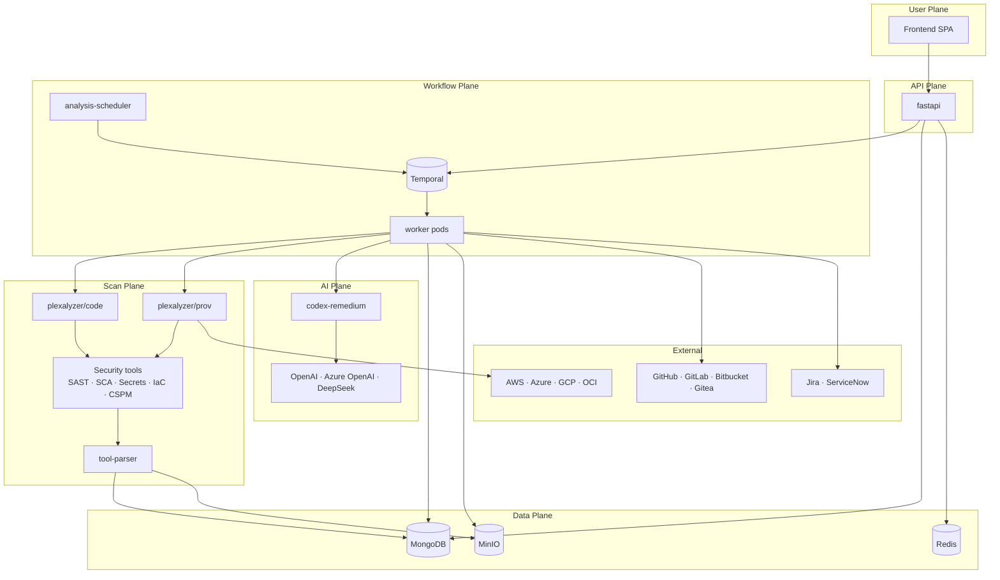

# Architecture \{#concepts_architecture-1\}

Plexicus is a monorepo of cooperating microservices, glued together by a workflow engine and a small set of shared databases. This page explains *what runs where* and *why* — read it once before deploying a self-hosted cluster or before debugging a hung scan.

## The 10,000-foot view \{#concepts_architecture-2\}



Five planes, one promise: every external call is owned by exactly one service. Workers do not call OpenAI directly; the API does not run security tools; the frontend never reads MongoDB.

## Services \{#concepts_architecture-3\}

The monorepo at [github.com/plexicus/platform](https://github.com/plexicus/platform) ships these top-level directories — each one is a Docker service.

<AccordionGroup>
  <Accordion title="fastapi/ — REST API + orchestrator" icon="material-symbols:api" defaultOpen>
    The synchronous edge. Authentication, multi-tenant client/team management, repository/connector CRUD, finding queries, dashboards, billing. Long-running work (scans, remediations, PR creation) is delegated to Temporal workflows; the API returns `202 Accepted` with a workflow handle and the client polls or subscribes via WebSocket.

    Reads/writes MongoDB and Redis directly. Talks to Temporal as a client.
  </Accordion>

  <Accordion title="worker/ — Temporal workers" icon="material-symbols:settings-suggest-outline">
    Where the actual work happens. Workflows are organized by domain: `Finding/`, `Repository/`, `Scan/`, `Remediation/`, `Integration/`, `Notification/`, `Tools/`, `Schedules/`, `OAUTH/`. Workers are deployed in pools — some static (`WorkerManager`), some per-tenant (`DynamicWorkerManager`).

    Workers are the only services that talk to SCM providers, ticketing systems, Codex Remedium, and Plexalyzer. If a workflow is hung, this is where you look.
  </Accordion>

  <Accordion title="plexalyzer/ — security-tool orchestrator" icon="material-symbols:security">
    Two variants. `plexalyzer/code` runs SAST/SCA/secrets/IaC scanners against checked-out source. `plexalyzer/prov` runs cloud-posture checks (CSPM/CWPP/CIEM) against AWS/Azure/GCP/OCI accounts. Both expose a single `POST /analyze` endpoint and stream tool output back to the worker that called them.

    Plexalyzer does not store findings. It executes tools and returns raw output to `tool-parser`.
  </Accordion>

  <Accordion title="tool-parser/ — normalize + enrich" icon="material-symbols:filter-alt-outline">
    Receives raw tool output (JSON/SARIF) and walks it through a fixed pipeline:

    ```text
    parser → standardizer → CWE/OWASP/EPSS enrichment → CosmosOptimizer → MongoDB
    ```

    Every supported scanner (Bandit, Trivy, Gitleaks, Opengrep, Checkov, KICS, …) has a dedicated parser under `tool-parser/parsers/`. The output is a uniform Finding document, regardless of source tool.
  </Accordion>

  <Accordion title="codex-remedium/ — AI remediation engine" icon="material-symbols:auto-fix">
    Generates patch diffs for eligible findings. Receives a finding ID + code snippet + vulnerability type, calls the configured LLM (OpenAI, Azure OpenAI, or DeepSeek via LiteLLM), validates the resulting diff applies cleanly, and returns it to the worker that requested it.

    Codex Remedium is stateless and idempotent — it does not write to MongoDB or open pull requests itself. That's the worker's job.
  </Accordion>

  <Accordion title="analysis-scheduler/ — periodic scan trigger" icon="material-symbols:schedule-outline">
    Runs as a CronJob (or one-shot pod). Walks every repository in MongoDB, checks the configured scan interval (per-repo or per-client default), and triggers `RequestRepoScanWorkflow` on Temporal for any repo that is due. Free-tier clients are skipped.

    This is the only service whose schedule depends on external time, not on user actions.
  </Accordion>

  <Accordion title="plugins/ — SCM adapters" icon="material-symbols:extension-outline">
    A library, not a service. Each plugin (`github`, `gitlab`, `bitbucket`, `gitea`) implements the same interface for clone, branch listing, PR/MR creation, and webhook handling. Workers import this library; the API does not.
  </Accordion>

  <Accordion title="ticketing_services/ — Jira / ServiceNow" icon="material-symbols:checklist-outline">
    Adapters for outbound ticketing. Used by `SendToDevTeamWorkflow` to mirror findings into your team's existing tracker.
  </Accordion>

  <Accordion title="libcovulor/ — shared DB + domain library" icon="material-symbols:database-outline">
    Pydantic models, MongoDB collection helpers, and domain constants shared across every Python service. The single source of truth for the Finding schema.
  </Accordion>
</AccordionGroup>

## Data plane \{#concepts_architecture-4\}

Three stateful systems. Each owns a single class of data; the API and workers route to whichever one is right.

| Store | Purpose | Held data |
|---|---|---|
| **MongoDB** | Primary database | Clients, users, teams, repositories, applications, findings, remediations, audit log |
| **Redis** | Cache + Pub/Sub | Session tokens, rate limits, WebSocket pub/sub for live UI updates, Temporal task signals |
| **MinIO** | Object storage | SBOM files, raw scan archives, code snippets, anything binary |

MongoDB stores **references** to MinIO objects (called "blob specs") — never the binary data itself. This keeps document size bounded and lets you back up structured data separately from artifacts.

## How the security coverage maps \{#concepts_architecture-5\}

Plexicus orchestrates open-source and commercial scanners across four CNAPP pillars. The mapping is fixed; the *active* tool list per scan is configurable.

<CardGroup cols={2}>
  <Card title="ASPM — Application Security Posture" icon="material-symbols:code-blocks-outline">
    SAST: Opengrep, Bandit, Semgrep, Checkmarx, Fortify
    SCA: OWASP Dependency-Check, Trivy SCA, Syft, BlackDuck
    Secrets: TruffleHog, Gitleaks
    IaC: TFLint, KICS, Checkov, Hadolint
  </Card>
  <Card title="CSPM — Cloud Security Posture" icon="material-symbols:cloud-outline">
    CloudSploit · Prowler · custom CloudQuery rules
    Targets: AWS, Azure, GCP, OCI
    Triggered via `plexalyzer/prov`
  </Card>
  <Card title="CWPP — Cloud Workload Protection" icon="material-symbols:shield-outline">
    Container scanning: Trivy, Grype, Checkov
    Runtime: Yara, ClamAV
    Supply-chain attestation: SLSA
  </Card>
  <Card title="CIEM — Cloud Entitlement Management" icon="material-symbols:key-outline">
    IAM permission analysis across AWS / Azure / GCP
    Excessive-privilege detection
    Cross-account trust auditing
  </Card>
</CardGroup>

## Why workflows, not request-response? \{#concepts_architecture-6\}

A scan is not a 200ms HTTP call. It clones a repo, runs five to fifteen scanners, parses gigabytes of output, enriches every finding against external CVE/EPSS feeds, and may trigger an AI remediation that itself takes minutes.

Doing that synchronously over HTTP would mean:

- Browser timeouts at 30 seconds
- Lost work on every pod restart
- No observability into where a stuck scan actually stopped
- No way to retry just the failed step

Temporal solves all four. Every long-running operation is a workflow with durable state, automatic retries, and observable timeline. The trade-off is operational complexity (Temporal + Postgres for its own state) — paid once, repeated never.

## What's next \{#concepts_architecture-7\}

<CardGroup cols={2}>
  <Card title="Applications Lifecycle" icon="material-symbols:rocket-launch-outline" href="/docs/concepts/applications-lifecycle">
    What happens after a user clicks "Scan" — the four lifecycle states and how Plexalyzer turns them into findings.
  </Card>
  <Card title="Findings Model" icon="material-symbols:bug-report-outline" href="/docs/concepts/findings-model">
    The Finding object: fields, statuses, the App/SCM/Cloud distinction, and the enrichment pipeline.
  </Card>
  <Card title="AI Remediation" icon="material-symbols:auto-fix" href="/docs/concepts/ai-remediation">
    From an eligible finding to a merged pull request, with every Temporal workflow named.
  </Card>
  <Card title="Self-Hosted Reference" icon="material-symbols:dns-outline" href="/docs/self-hosted">
    Deploy this architecture on your own Kubernetes cluster.
  </Card>
</CardGroup>
