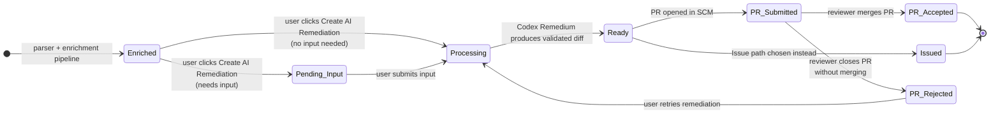

# Findings Model \{#concepts_findings-model-1\}

A **Finding** is the unit of risk in Plexicus. Every scanner output, every misconfiguration, every leaked secret eventually becomes one Finding document in MongoDB with a uniform schema. This page explains what's in that document, where the data comes from, and how a Finding moves from raw scanner output to a closed pull request.

## The three families: App / SCM / Cloud \{#concepts_findings-model-2\}

The Findings page splits into three subpages because the *thing being analyzed* is fundamentally different in each case.

<CardGroup cols={3}>
  <Card title="App" icon="material-symbols:code-blocks-outline">
    **What:** code-level vulnerabilities — SAST, SCA, secrets in source, IaC misconfigurations.
    **Source:** `plexalyzer/code` running scanners against checked-out repos.
    **Resolution:** PR with a code change.
  </Card>
  <Card title="SCM" icon="material-symbols:fork-right-outline">
    **What:** repository-configuration risks — branch protection off, force-push allowed, no required reviewers, exposed deploy keys.
    **Source:** SCM API queries via the `plugins/` library.
    **Resolution:** SCM-side configuration change (often manual; some can be PR'd as `.github/` files).
  </Card>
  <Card title="Cloud" icon="material-symbols:cloud-outline">
    **What:** cloud-posture risks — public S3 buckets, overly permissive IAM, missing encryption-at-rest, drift from baseline.
    **Source:** `plexalyzer/prov` running CSPM/CWPP/CIEM tools against your cloud accounts.
    **Resolution:** Terraform / CloudFormation / Azure-Policy change in IaC, or a manual console fix.
  </Card>
</CardGroup>

The three are **separate API endpoints** (`/findings`, `/findings/scm`, `/findings/cloud`) and separate filter sets, but they share the same Finding schema underneath.

## What's in a Finding document \{#concepts_findings-model-3\}

Every Finding, regardless of family, has these core fields. The schema is defined in `libcovulor/` and consumed by every service.

| Field | Type | Where it comes from |
|---|---|---|
| `_id` | string | Generated on insert |
| `title` | string | Tool's `title` or rule name |
| `severity` | enum: Critical · High · Medium · Low · Informational | Tool's severity, normalized |
| `priority` | integer | Recalculated by Plexicus (see below) |
| `status` | enum (lifecycle) | Workflow-driven; see next section |
| `tool` | string | Which scanner reported it (`bandit`, `trivy`, `gitleaks`, …) |
| `file` | string | Relative path inside the repo |
| `line` | integer | Line number |
| `cwe` | string | Tool's mapping or rule_enricher's lookup |
| `owasp` | string | rule_enricher mapping |
| `epss` | float | EPSS score from FIRST.org, looked up at enrichment time |
| `remediation_type` | enum: `pr` · `issue` | Set by the parser per CWE |
| `description` | string | Tool's description, possibly enriched |
| `code_snippet_ref` | MinIO blob ref | Pointer to the snippet stored in MinIO |

Every field is set during the enrichment pipeline (next section). Nothing is computed at read time except `priority`, which the dashboard recomputes against your tuning rules.

## The enrichment pipeline \{#concepts_findings-model-4\}

Raw tool output is not a Finding. It becomes one by walking a fixed pipeline implemented in `tool-parser/`:

```mermaid
flowchart LR
    A[Raw tool output<br/>JSON / SARIF] --> B[tool-parser/<br/>parsers/]
    B --> C[Standardizer.py<br/>normalize fields]
    C --> D[rule_enricher.py<br/>CWE · OWASP · EPSS]
    D --> E[CosmosOptimizer.py<br/>dedupe across scans]
    E --> F[(MongoDB)]
    F --> G[FindingInputWorkflow]
    G --> H[FindingEnrichmentWorkflow<br/>owner · code snippet]
    H --> I[FindingValidationWorkflow<br/>code-context check]
    I --> J[Finding ready]
```

What each step does:

- **Parser** — per-tool adapter (`BanditParser.py`, `TrivyScaParser.py`, …). Extracts the fields the standardizer needs.
- **Standardizer** — collapses 20 different severity strings into 5 enum values, normalizes file paths, makes CWE ids consistent.
- **rule_enricher** — adds CWE → OWASP Top 10 mapping, attaches EPSS exploit-probability score, looks up CVE detail when available.
- **CosmosOptimizer** — checks if this finding existed in the previous scan. If yes, preserves the existing `_id` so the user's tuning (false-positive flag, assigned developer, suppression) carries forward.
- **FindingInputWorkflow** — Temporal workflow that persists the Finding to MongoDB inside a transaction.
- **FindingEnrichmentWorkflow** — fetches the file owner from `git blame`, materializes the code snippet to MinIO, attaches the blob reference.
- **FindingValidationWorkflow** — re-checks the code at the cited line against the rule. Catches "the line moved before the scan finished" cases.

After Validation, the Finding is **Enriched** and visible in the UI.

## Lifecycle states \{#concepts_findings-model-5\}

A Finding moves through a finite-state machine. The state is a single field on the document, set by the workflow that owns the transition.

What each status means in plain language:

<AccordionGroup>
  <Accordion title="Enriched" icon="material-symbols:auto-awesome-outline" defaultOpen>
    The Finding has finished the enrichment pipeline and is visible to the user. **Default state for any new finding.** No remediation has been requested yet.
  </Accordion>
  <Accordion title="Pending Input" icon="material-symbols:edit-outline">
    The remediation needs a human decision before AI can proceed (e.g. choose between "pin dep to 1.2.4" vs "remove dep entirely"). The Temporal workflow is paused on a signal; the UI shows an input form.
  </Accordion>
  <Accordion title="Processing" icon="material-symbols:settings-outline">
    Codex Remedium is running. The worker is talking to the LLM and validating the candidate diff. Typical duration: 10–60 seconds; deep transitive rewrites can be longer.
  </Accordion>
  <Accordion title="Ready" icon="material-symbols:check-circle-outline">
    A validated diff (or issue body) is ready. The user can now choose **Create Pull Request** or **Create Issue**. Plexicus does not auto-submit unless `auto_create=true` was set on the original `POST /remediations` request.
  </Accordion>
  <Accordion title="PR Submitted" icon="material-symbols:upload-outline">
    A pull/merge request has been opened in the SCM. The Finding now waits on a human review. Plexicus polls the SCM webhook (or pulls on a timer) for merge events.
  </Accordion>
  <Accordion title="Issued" icon="material-symbols:checklist-outline">
    For findings whose `remediation_type = issue` (or where the user chose Issue over PR), an issue ticket has been created — either in the SCM or, via `ticketing_services/`, in Jira / ServiceNow.
  </Accordion>
  <Accordion title="PR Accepted" icon="material-symbols:verified-outline">
    The PR was merged. The Finding is closed. **Terminal state.**
  </Accordion>
  <Accordion title="PR Rejected" icon="material-symbols:close-outline">
    The PR was closed without merging. The Finding becomes eligible for a new remediation attempt; the user can also flag it as a false positive or accept the risk.
  </Accordion>
</AccordionGroup>

## Severity vs priority — they are different \{#concepts_findings-model-6\}

A scanner reports **severity** based on its own ruleset (often CVSS-driven). Plexicus computes **priority** by recalculating against runtime context:

- Is the affected code reachable in production? (call-graph analysis from CPG)
- Is the secret actually still active? (revocation check via the affected provider)
- Is the dependency loaded at runtime, or only by tests?
- Is the cloud resource public, or behind a private VPC?

A `Critical` CVE in a transitive dependency that's only used by your test runner gets demoted. A `Medium` SQL-injection in a publicly-reachable login endpoint gets promoted.

This is why the UI sorts by **priority** by default, not severity. If you want raw scanner severity, change the sort field on the Findings page.

## False positives, mitigation, and suppression \{#concepts_findings-model-7\}

Three different actions, three different effects.

| Action | API endpoint | What it changes | Survives next scan? |
|---|---|---|---|
| **Toggle false positive** | `PUT /findings/{id}/toggle_false_positive` | Sets `false_positive: true`, hides from default views | Yes — CosmosOptimizer carries it forward |
| **Mark as mitigated** | `POST /findings/{id}/mark-as-mitigated` | Status → `Mitigated`, removes from active count | Yes |
| **Suppress by rule** (org-level) | Tuning rules in Settings | Adds rule to client-level filter; future findings matching the rule are auto-flagged | Yes, applies to all future scans |

The first two affect *this finding*. The third affects *every future finding that matches the pattern*.

## Related \{#concepts_findings-model-8\}

<CardGroup cols={2}>
  <Card title="Applications Lifecycle" icon="material-symbols:rocket-launch-outline" href="/docs/concepts/applications-lifecycle">
    How an Application turns into the findings you see here.
  </Card>
  <Card title="AI Remediation" icon="material-symbols:auto-fix" href="/docs/concepts/ai-remediation">
    What happens after a Finding moves into Processing.
  </Card>
  <Card title="Work with Findings (Recipe)" icon="material-symbols:bolt-outline" href="/docs/recipes/work-with-findings">
    The user-facing flow for triaging, filtering, and remediating.
  </Card>
  <Card title="Architecture" icon="material-symbols:dns-outline" href="/docs/concepts/architecture">
    Where MongoDB, MinIO, and tool-parser live.
  </Card>
</CardGroup>
