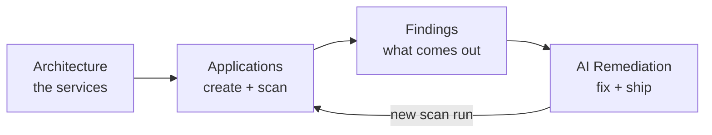

# Core Concepts \{#concepts_index-1\}

Four pages. They explain *how Plexicus works*, not *how to use it*. If you only ever click through the UI, you can skip this section. If you operate Plexicus, debug a stuck scan, or design integrations against it, read all four — once, in order.

<CardGroup cols={2}>
  <Card
    title="Architecture"
    icon="material-symbols:dns-outline"
    href="/docs/concepts/architecture"
  >
    The services, the data plane, and the boundaries between them. What runs where.
  </Card>
  <Card
    title="Applications Lifecycle"
    icon="material-symbols:rocket-launch-outline"
    href="/docs/concepts/applications-lifecycle"
  >
    What happens between "click Add Application" and "findings are ready" — the four states and the workflows that own them.
  </Card>
  <Card
    title="Findings Model"
    icon="material-symbols:bug-report-outline"
    href="/docs/concepts/findings-model"
  >
    What a Finding is. App vs SCM vs Cloud. Statuses, the enrichment pipeline, severity vs priority.
  </Card>
  <Card
    title="How AI Remediation Works"
    icon="material-symbols:auto-fix"
    href="/docs/concepts/ai-remediation"
  >
    From an eligible finding to a merged pull request — the Codex Remedium pipeline, every Temporal workflow named.
  </Card>
</CardGroup>

## How they fit together \{#concepts_index-2\}

Architecture is the room. Applications run *in* the room. Findings are *what* applications produce. AI Remediation is *what closes* findings.

## When to come back \{#concepts_index-3\}

- **A scan is stuck.** Read [Applications Lifecycle](/docs/concepts/applications-lifecycle) — the four states map directly to which workflow to inspect in Temporal.
- **A finding looks wrong.** Read [Findings Model](/docs/concepts/findings-model) — severity vs priority, the enrichment pipeline, false-positive vs mitigated vs suppressed.
- **A remediation never opens a PR.** Read [How AI Remediation Works](/docs/concepts/ai-remediation) — the nine sequential steps and what to check at each one.
- **Designing an integration.** Read [Architecture](/docs/concepts/architecture) — pick the right service to call; never call workers or scanners directly.
