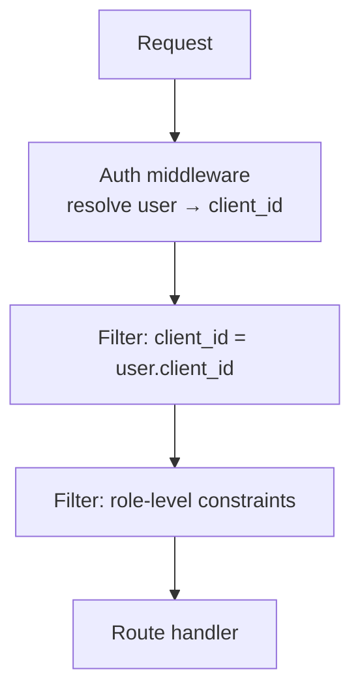

# Multi-tenant Security Model \{#concepts_multi-tenant-security-1\}

This page is the trust contract between Plexicus and a tenant. Read it before deciding what code, secrets, or findings to expose to the platform.

## Tenant boundary \{#concepts_multi-tenant-security-2\}

A **tenant** in Plexicus = a Client document in MongoDB. Every other domain object — repositories, applications, findings, remediations, audit log entries — has a `client_id` field. **Every query is server-side filtered by `client_id`** before any role-level filtering applies.

There is **no API path** that bypasses the client_id filter for a non-Superadmin caller. Removing it would be a security regression caught in code review and CI.

## Secrets — what's stored, where \{#concepts_multi-tenant-security-3\}

Plexicus handles three classes of secrets. Each lives in a different store with different lifetimes.

| Class | Examples | Store | Encrypted at rest? |
|---|---|---|---|
| Tenant credentials | SCM OAuth tokens, AI API keys, Jira tokens | MongoDB Client document | ✅ — AES-256-GCM with `SSO_ENCRYPTION_KEY` (or equivalent per-deployment key) |
| Per-user credentials | Session JWTs, 2FA TOTP secrets | MongoDB Users / Sessions | ✅ |
| Build-time secrets | `GH_APP_PRIVATE_KEY`, `STRIPE_API_KEY`, `SECRET_KEY` | Kubernetes Secret (self-hosted) or vault provider | ✅ |
| Generated diffs / LLM transcripts | (transient — see below) | **Not stored** | N/A |

The "Not stored" row is intentional. Plexicus does not retain LLM prompts or responses. If you need audit trails of what the model said for a given remediation, configure your LLM provider's own logging (Azure OpenAI content-safety logs, OpenAI request retention).

## What crosses the network \{#concepts_multi-tenant-security-4\}

Source-of-truth list of everything that leaves the cluster on a typical scan:

<AccordionGroup>
  <Accordion title="To your SCM" icon="material-symbols:fork-right-outline" defaultOpen>
    - **git clone** of repositories you've connected.
    - **REST API calls** to fetch branches, file content, commit history.
    - **PR / Issue creation** when you ask for remediations.
    - **Webhook ACKs** in response to inbound events.

    Scope: only the SCM you connected, only the repos you authorized.
  </Accordion>

  <Accordion title="To your AI provider" icon="material-symbols:auto-awesome">
    - **Code snippets** (typically ±20 lines around a finding) sent to OpenAI / Azure OpenAI / DeepSeek for remediation generation.
    - **Vulnerability metadata** (CWE, severity, file path) included in the prompt.

    Scope: only triggered by an explicit user action (Create AI Remediation, Bulk Remediate). Never on raw scans.

    **What is NOT sent:** the entire repo, your other findings, other tenants' code, anything from Plexicus's own infrastructure.
  </Accordion>

  <Accordion title="To your ticketing" icon="material-symbols:checklist-outline">
    - **Finding data** (title, description, severity, repo, file/line, CWE) when you mirror to Jira / ServiceNow.
    - **Status updates** when remediations close.

    Scope: only triggered by explicit user action (Create Issue) or org-level auto-mirror config.
  </Accordion>

  <Accordion title="To your cloud provider (CSPM/CWPP)" icon="material-symbols:cloud-outline">
    - **Read-only IAM API calls** against AWS / Azure / GCP / OCI for posture scans.
    - **Resource enumeration** (S3 buckets, IAM roles, VPC configs).

    Scope: only the cloud accounts you connected, only with the read-only role you provisioned.
  </Accordion>

  <Accordion title="What does NOT leave on a self-hosted deployment" icon="material-symbols:shield-outline">
    On a [self-hosted Plexicus](/docs/self-hosted), no telemetry, analytics, or feedback data goes to Plexicus.ai or any third party. The platform is self-contained except for the integrations *you* configure (your SCM, your AI provider, your SMTP, your IdP). This is the no-phone-home guarantee.

    On the SaaS, normal product analytics apply (page views, feature usage) but never your code or your findings.
  </Accordion>
</AccordionGroup>

## The CPG (Code Property Graph) — and where it doesn't go \{#concepts_multi-tenant-security-5\}

Plexicus builds a Code Property Graph from your source during enrichment. The CPG is used for:

- Reachability analysis (is this vulnerable function actually called?)
- Severity recalibration (`priority` field on findings)
- Cross-finding correlation (is this CVE actually exploitable given your codepaths?)

The CPG **stays inside the Plexicus deployment**. It is not sent to the LLM, ticketing, or anywhere external. It is regenerated on each scan and only the *result* (priority adjustments, reachability flags) is persisted to MongoDB.

## Network egress on self-hosted \{#concepts_multi-tenant-security-6\}

For air-gapped or restricted environments, the only mandatory egress is:

| Destination | Why | Can be disabled? |
|---|---|---|
| Your SCM | Clone + PR | No — core functionality |
| Your AI provider | Remediation | Yes — disable AI Remediation feature |
| Your SMTP | Verification emails | Yes — disable email verification |
| FIRST.org | EPSS score lookups | Yes — accept enrichment without EPSS |
| Plexicus image registry (`europe-west3-docker.pkg.dev`) | Pulling Helm chart + container images | Mirror to your internal registry; see [Air-Gapped Installation](/docs/self-hosted/air-gapped) |

There is **no telemetry endpoint** that needs allowlisting on a self-hosted deployment. Plexicus does not phone home.

## Audit trail \{#concepts_multi-tenant-security-7\}

Every state-changing action writes to the `HistoryUser` MongoDB collection with: `user_id`, `client_id`, `action`, `target_type`, `target_id`, `before`, `after`, `timestamp`. Retention is 365 days by default — configurable via `AUDIT_RETENTION_DAYS` env var on self-hosted.

This collection is the source for compliance evidence (SOC 2 access reviews, GDPR data-subject-access requests).

## Threat model summary \{#concepts_multi-tenant-security-8\}

| Threat | Defense |
|---|---|
| Cross-tenant data leak | Server-side `client_id` filter on every query; no Superadmin in normal config |
| Stolen API token | Short token lifetimes + revocation on any leak signal; tokens scope to one user's permissions |
| LLM training-data leak | Plexicus does not store prompts/responses; your LLM provider's data policy is the contract |
| Compromised SCM creds | OAuth tokens encrypted at rest; revoking on the SCM side immediately invalidates Plexicus's access |
| Insider threat (cyberoper marks valid finding as false-positive) | Audit log captures `before`/`after` of every state change |
| Supply-chain attack on Plexicus images | Image signatures (cosign) verifiable on the air-gapped install path; SBOM available per release |

## Related \{#concepts_multi-tenant-security-9\}

<CardGroup cols={2}>
  <Card title="Roles and Permissions" icon="material-symbols:admin-panel-settings-outline" href="/docs/concepts/roles-and-permissions">
    The role layer that runs after tenant filtering.
  </Card>
  <Card title="Compliance" icon="material-symbols:gavel-outline" href="/docs/concepts/compliance">
    How this model maps to PCI / SOC 2 / NIST / ISO / GDPR / HIPAA controls.
  </Card>
  <Card title="Self-Hosted" icon="material-symbols:dns-outline" href="/docs/self-hosted">
    Run all of this on your own cluster.
  </Card>
</CardGroup>
