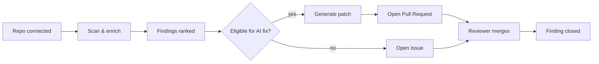

# Welcome to Plexicus \{#getting-started_introduction-1\}

Plexicus is an AI-powered **Cloud-Native Application Protection Platform (CNAPP)**. It scans your code and cloud, prioritizes what actually matters, and generates the patch as a pull request — closing the loop from finding to merge without leaving the platform.

This site is the operator's manual. Pick a starting point below.

<CardGroup cols={2}>
  <Card
    title="I'm onboarding the company"
    icon="material-symbols:rocket-launch-outline"
    href="/docs/getting-started/quickstart"
  >
    Register, configure your organization, connect your first SCM and cloud,
    invite the team. Plan to spend ~10 minutes.
  </Card>
  <Card
    title="I'm a developer triaging a finding"
    icon="material-symbols:bug-report-outline"
    href="/docs/recipes/work-with-findings"
  >
    Skip the org setup. Jump straight to filtering findings, generating
    AI remediations, and reviewing the resulting PR.
  </Card>
  <Card
    title="I want to deploy on my own cluster"
    icon="material-symbols:dns-outline"
    href="/docs/self-hosted"
  >
    Helm chart, local k3s evaluation, or air-gapped install — pick the path
    that matches your environment. No telemetry leaves the cluster.
  </Card>
  <Card
    title="I just want to understand the platform"
    icon="material-symbols:menu-book-outline"
    href="/docs/getting-started/key-features"
  >
    The capability map across ASPM, CSPM, CWPP, and CIEM, plus the tools
    we orchestrate behind each one.
  </Card>
</CardGroup>

---

## How the loop works \{#getting-started_introduction-2\}

1. **Connect a source code repository or a cloud account.** Plexicus orchestrates SAST, SCA, secrets, IaC, container, CSPM, CWPP, and CIEM scanners.
2. **Scans run and findings are enriched.** Severity is recalculated using runtime context, not just the scanner's default CVSS.
3. **Eligible findings are remediated by AI.** The platform generates a patch, validates it, and opens a pull request in your SCM.
4. **A reviewer merges.** The finding closes automatically when the PR lands.

---

## Roles \{#getting-started_introduction-3\}

Plexicus enforces three roles. Pick the right one when you invite a teammate.

| Action                | Admin | Cyberoper | Developer |
| --------------------- | :---: | :-------: | :-------: |
| Add team members      | ✅ | — | — |
| Connect repositories  | ✅ | — | ✅ |
| View all findings     | ✅ | ✅ | — |
| Send findings to dev  | ✅ | ✅ | — |
| Edit suggested patch  | ✅ | ✅ | ✅ |
| Open the pull request | ✅ | — | ✅ |
| Request review        | — | — | ✅ |

:::tip Persona shortcut
**Admin** = sets up the org. **Cyberoper** = security analyst, triages findings. **Developer** = ships the fix. The Quickstart walks the Admin path; the Developer path starts at [Work with Findings](/docs/recipes/work-with-findings).
:::
