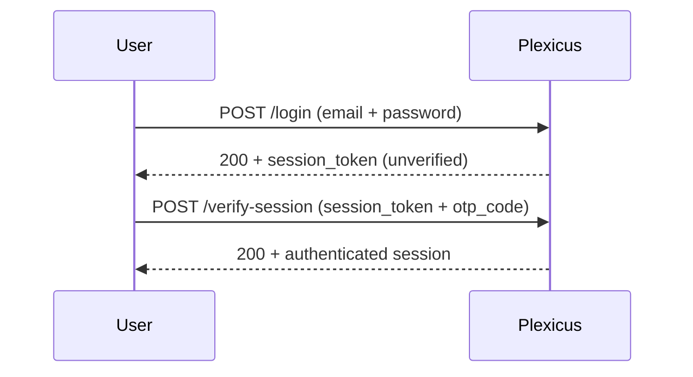

# Configure 2FA \{#recipes_configure-2fa-1\}

Plexicus supports TOTP (time-based one-time password) as a second factor — works with Google Authenticator, Authy, 1Password, Bitwarden, or any RFC 6238-compliant app. SMS-based 2FA is not supported by design (SIM-swapping risk).

:::tip If you have SSO
2FA at the Plexicus layer is redundant if your IdP enforces 2FA — the IdP gates the login, Plexicus just trusts the SAML/OIDC assertion. Configure 2FA on the IdP instead. See [Configure SSO](/docs/recipes/configure-sso).
:::

## Personal: enable 2FA on your own account \{#recipes_configure-2fa-2\}

<Steps>
  <Step title="Open Account → Authentication">
    Or hit [app.plexicus.ai/settings#authentication](https://app.plexicus.ai/settings#authentication) directly.
  </Step>
  <Step title="Click Enable two-factor authentication">
    Plexicus calls `POST /user/configure-2fa` and returns:
    - A QR code containing the TOTP secret
    - The secret in plain text (in case you can't scan)
  </Step>
  <Step title="Scan with your authenticator app">
    Open Google Authenticator / Authy / 1Password → add account → scan the QR code. The app starts generating 6-digit codes that rotate every 30 seconds.

    **Save the secret somewhere too** — you cannot retrieve it later. If you lose your authenticator, you need this secret to recover.
  </Step>
  <Step title="Verify the code">
    Type the current 6-digit code into Plexicus and click Confirm. Plexicus calls `POST /user/check-secret-2fa` to validate the code matches the secret. On success it calls `POST /user/save-2fa` and 2FA is now active.
  </Step>
  <Step title="Save backup codes">
    Plexicus shows 8 one-time backup codes. Store them in your password manager. Each code works exactly once if you lose access to your authenticator.
  </Step>
</Steps>

## Personal: log in with 2FA \{#recipes_configure-2fa-3\}

After 2FA is active, the login flow becomes:

If you don't submit the OTP within 5 minutes, the unverified session expires and you start over.

## Personal: disable 2FA \{#recipes_configure-2fa-4\}

<Steps>
  <Step title="Open Account → Authentication">
    Click **Remove 2FA**.
  </Step>
  <Step title="Confirm with current OTP">
    Plexicus requires a fresh OTP code to confirm — proves you still have the authenticator. Calls `POST /user/remove-2fa`.
  </Step>
</Steps>

## Org-level: require 2FA for all users \{#recipes_configure-2fa-5\}

Admins can enforce 2FA across the organization:

<Steps>
  <Step title="Organization → Security → Two-factor authentication">
    Toggle **Require 2FA for all users**.
  </Step>
  <Step title="Set a grace period">
    Default is 7 days — users without 2FA see a warning banner during this window. After expiry, password login is rejected until they enroll. Pick a grace period that covers vacationers.
  </Step>
  <Step title="Notify the team">
    Plexicus sends an email to every user without 2FA. The email links straight to the enrollment page.
  </Step>
</Steps>

Existing users who don't enroll within the grace period get locked out — they need an admin to either reset their account or extend the grace.

## Recovery: lost authenticator \{#recipes_configure-2fa-6\}

Three recovery paths:

<AccordionGroup>
  <Accordion title="Use a backup code" icon="material-symbols:key-outline" defaultOpen>
    On the OTP prompt, click **Use backup code**. Each code works once. After using, generate new backup codes (Account → Authentication → Generate new backup codes).
  </Accordion>
  <Accordion title="Re-add the secret to a new authenticator" icon="material-symbols:smartphone-outline">
    If you saved the secret string when enrolling, paste it into the new authenticator app. The new device will produce identical codes.
  </Accordion>
  <Accordion title="Admin reset" icon="material-symbols:admin-panel-settings-outline">
    Have an org Admin go to Organization → Team → click your row → **Reset 2FA**. Calls `POST /user/remove-2fa` on your behalf. You'll need to re-enroll.

    **Self-locked-out admin:** if no other Admin exists, you need the self-hosted break-glass procedure (`BREAK_GLASS_SECRET_KEY`) — see [Self-Hosted Configuration](/docs/self-hosted/configuration). On SaaS, contact support.
  </Accordion>
</AccordionGroup>

## API token compatibility \{#recipes_configure-2fa-7\}

[API tokens bypass 2FA](/docs/recipes/generate-api-token#recipes_generate-api-token-7) — that's intentional for CI/CD use cases. If your security policy forbids 2FA bypass, set short token expirations and rotate aggressively.

## Common errors \{#recipes_configure-2fa-8\}

<AccordionGroup>
  <Accordion title="`Invalid OTP code` even though it's right" icon="material-symbols:schedule-outline">
    Clock skew. TOTP codes are time-based. If your phone's clock is off by >30s, codes won't validate. Sync the phone's time and try again.
  </Accordion>
  <Accordion title="Backup codes don't work" icon="material-symbols:warning-outline">
    Backup codes are one-time. If you used a code before and didn't generate new ones, the remaining codes are still valid — but ones already used are not. Generate new codes after every recovery.
  </Accordion>
</AccordionGroup>

## Related \{#recipes_configure-2fa-9\}

<CardGroup cols={2}>
  <Card title="Configure SSO" icon="material-symbols:login-outline" href="/docs/recipes/configure-sso">
    Enterprise alternative to per-user 2FA.
  </Card>
  <Card title="Generate API Token" icon="material-symbols:key-outline" href="/docs/recipes/generate-api-token">
    For headless / CI use that bypasses 2FA cleanly.
  </Card>
</CardGroup>
